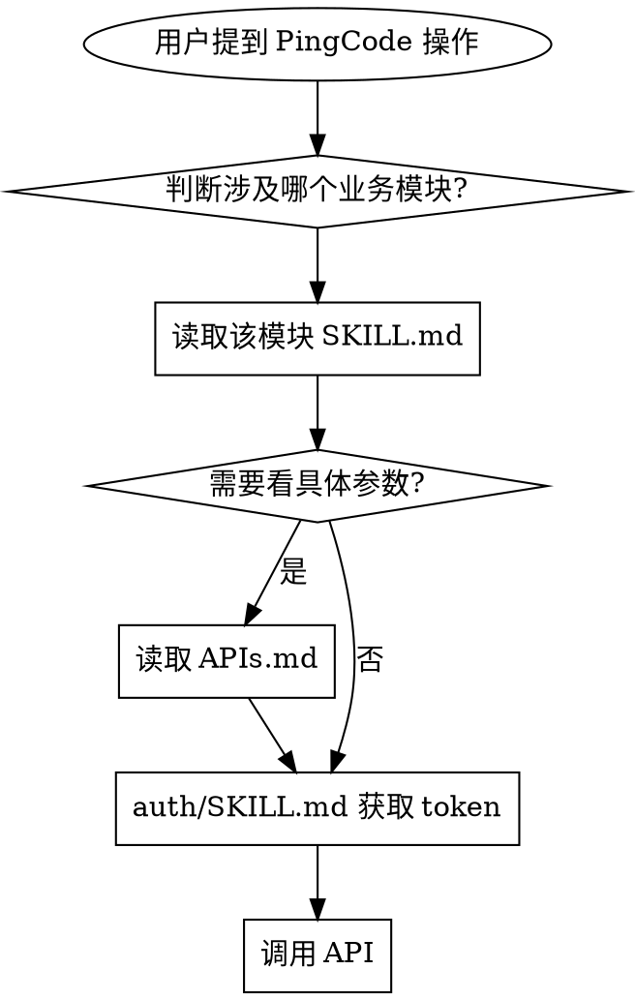

# PingCode API Skill

**当用户提及 PingCode（工作项、需求、缺陷、代码、测试、发布、知识库等）相关操作时使用。**

## 安装

**快速安装：** 将 `AGENT_INSTALL_PROMPT.md` 中的提示词发送给你的 Agent，自动完成安装。

**手动安装：** 查看 `INSTALL.md` 获取详细的安装步骤。

**支持的 Agent：** OpenCode、Claude Code、QwenPaw、Cursor，以及任何支持 skills 目录的 Agent。

---

封装 [PingCode REST API](https://open.pingcode.com/) 全部 **566 个接口**，按 11 个业务模块拆分。语言无关。

## 工作方式

按需加载——Agent 只读需要操作的模块，不浪费上下文。



## 快速开始

```bash
# 1. 获取令牌
TOKEN=$(curl -s "https://open.pingcode.com/v1/auth/token?grant_type=client_credentials&client_id=$PINGCODE_CLIENT_ID&client_secret=$PINGCODE_CLIENT_SECRET" | python3 -c "import sys,json;print(json.load(sys.stdin)['access_token'])")

# 2. 测试连通性
curl -s -H "Authorization: Bearer $TOKEN" "https://open.pingcode.com/v1/myself"
```

或用附带脚本（自动处理令牌缓存与刷新）：
```bash
python3 {baseDir}/scripts/pingcode.py '{"method":"GET","path":"/v1/myself"}'
```

**环境变量：** `PINGCODE_CLIENT_ID` ✅ | `PINGCODE_CLIENT_SECRET` ✅ | `PINGCODE_BASE_URL` ❌（默认 `https://open.pingcode.com`）

## 模块索引

| 模块 | 触发场景 | API 数 |
|------|----------|--------|
| `auth` | 🔑 需要获取/刷新 API 令牌 | 6 |
| `org` | 🏢 管理成员、部门、团队、角色 | 50 |
| `product` | 📦 管理产品、工单、客户、标签 | 85 |
| `workitem` | 📋 操作需求、任务、缺陷、评论、工时 | 94 |
| `code` | 💻 管理仓库、分支、PR、评审 | 44 |
| `test` | 🧪 测试用例与执行 | 70 |
| `release` | 🚀 构建、部署、发布 | 42 |
| `plan` | 📅 迭代、计划、路线图 | 34 |
| `wiki` | 📚 知识空间与页面 | 21 |
| `project` | ⚙️ 项目、看板、配置 | 45 |
| `project_config` | 🔧 字段、状态、类型配置 | 75 |

## API 通用约定

| 约定 | 说明 |
|------|------|
| 格式 | JSON（`application/json`）|
| 分页 | `page` + `size`，默认 30，最大 **100** |
| ID 格式 | 24 位十六进制（`5e05d8448f8461dada9ba29c`）|
| 限流 | 响应头 `X-RateLimit-Remaining` |
| Token 有效期 | 30 天 |

## ⚠️ Agent 必知规则（Bulletproofing）

| 规则 | 说明 |
|------|------|
| **按需加载模块** | 只读你需要的那一个模块的 APIs.md，不要一次性全加载 |
| **不硬编码 ID** | project_id / product_id 从对话获取或问用户 |
| **记住分页** | 列表接口默认 30 条，需要更多时 `?page=N&size=100` |
| **PATCH 不是 PUT** | 部分更新用 `PATCH`，不是 `PUT` |
| **留意限流头** | `X-RateLimit-Remaining` 接近 0 时减速 |
| **缓存 Token** | 30 天有效，但 25 天后主动刷新避免 401 |

## 工作流

详见 `workflow/apis.md`：

- **需求实现回写** → 读取需求 → 实现 → 回写评论 → 更新状态
- **代码关联** → 创建分支 → 关联提交 → 创建 PR
- **部署发布** → 获取环境 → 触发部署 → 创建版本

## 贡献

`python3 scripts/generate_docs.py <api_data.js>` 从 PingCode 官方 API 数据更新文档。