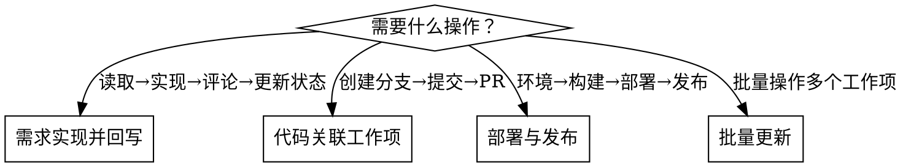

# 🔄 PingCode 工作流示例

## 工作流选择



---

## 流程一：需求实现 → 结果回写

**场景：** Agent 从 PingCode 读需求 → 实现 → 回写结果

```bash
# 1. 获取产品列表（product/）
curl -s -H "Authorization: Bearer $TOKEN" "https://open.pingcode.com/v1/ship/products?page=1&size=20"

# 2. 获取需求列表（workitem/）
curl -s -H "Authorization: Bearer $TOKEN" "https://open.pingcode.com/v1/ship/work_items?product_id=xxx&page=1&size=20"

# 3. 获取需求详情（workitem/）
curl -s -H "Authorization: Bearer $TOKEN" "https://open.pingcode.com/v1/ship/work_items/{work_item_id}"

# 4. 回写评论
curl -s -X POST -H "Authorization: Bearer $TOKEN" -H "Content-Type: application/json" \
  -d '{"content":"已实现需求，代码已提交"}' \
  "https://open.pingcode.com/v1/ship/work_items/{work_item_id}/comments"

# 5. 更新状态为"已完成"
curl -s -X PATCH -H "Authorization: Bearer $TOKEN" -H "Content-Type: application/json" \
  -d '{"status":"已完成"}' \
  "https://open.pingcode.com/v1/ship/work_items/{work_item_id}"
```

---

## 流程二：代码提交关联工作项

**场景：** Agent 实现需求后，创建分支、提交代码、发起 PR

```bash
# 1. 创建分支（code/）
curl -s -X POST -H "Authorization: Bearer $TOKEN" -H "Content-Type: application/json" \
  -d '{"name":"feature/work-item-xxx","ref":"main"}' \
  "https://open.pingcode.com/v1/ship/products/{product_id}/repositories/{repo_id}/branches"

# 2. 关联提交引用（code/）
curl -s -X POST -H "Authorization: Bearer $TOKEN" -H "Content-Type: application/json" \
  -d '{"commit_sha":"abc123","repository_id":"xxx"}' \
  "https://open.pingcode.com/v1/ship/work_items/{work_item_id}/commit_references"

# 3. 创建 PR（code/）
curl -s -X POST -H "Authorization: Bearer $TOKEN" -H "Content-Type: application/json" \
  -d '{"title":"feat: xxx","head_branch":"feature/xxx","base_branch":"main"}' \
  "https://open.pingcode.com/v1/ship/products/{product_id}/repositories/{repo_id}/pull_requests"
```

---

## 流程三：部署与发布

**场景：** 自动触发构建 → 部署 → 创建发布版本

```bash
# 1. 获取环境列表（release/）
curl -s -H "Authorization: Bearer $TOKEN" "https://open.pingcode.com/v1/release/environments?product_id=xxx"

# 2. 获取/触发构建（release/）
curl -s -X POST -H "Authorization: Bearer $TOKEN" -H "Content-Type: application/json" \
  -d '{"repository_id":"xxx","branch":"main"}' \
  "https://open.pingcode.com/v1/ci/builds"

# 3. 创建部署记录（release/）
curl -s -X POST -H "Authorization: Bearer $TOKEN" -H "Content-Type: application/json" \
  -d '{"build_id":"xxx","environment_id":"xxx"}' \
  "https://open.pingcode.com/v1/cd/deployments"

# 4. 创建发布版本（release/）
curl -s -X POST -H "Authorization: Bearer $TOKEN" -H "Content-Type: application/json" \
  -d '{"name":"v1.0.0","description":"首次发布"}' \
  "https://open.pingcode.com/v1/ship/versions"
```

---

## 流程四：批量操作

```bash
# 批量更新工作项状态（workitem/）
curl -s -X PATCH -H "Authorization: Bearer $TOKEN" -H "Content-Type: application/json" \
  -d '{"status":"已完成"}' \
  "https://open.pingcode.com/v1/pjm/work_items?ids=id1,id2,id3"

# 批量获取工作项
curl -s -H "Authorization: Bearer $TOKEN" \
  "https://open.pingcode.com/v1/pjm/work_items?project_id=xxx&page=1&size=100"
```

---

## ⚠️ 常见工作流错误（Agent 必读）

| 错误 | 正确做法 |
|------|----------|
| 直接创建 PR 而不先查项目/仓库 | 先 `GET /v1/scm/repositories` 获取 `repo_id` |
| 写评论时用错 `principal_type` | 工作项评论用 `pjm_work_item`，需求评论用 `ship_idea` |
| 忘记关联提交和 PR | 创建 PR 后用 `POST /v1/relations` 关联到工作项 |
| 更新状态用 PUT 而非 PATCH | 部分更新一律用 **PATCH** |
| 一次性更新所有工作项而不分页 | 批量操作时分批处理（每批最多 100 条） |
